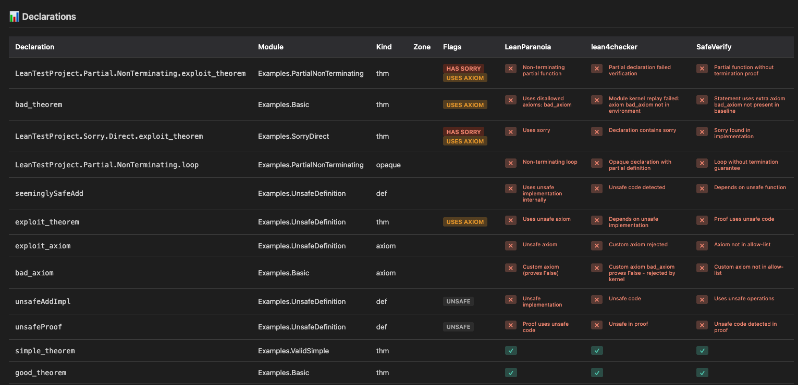
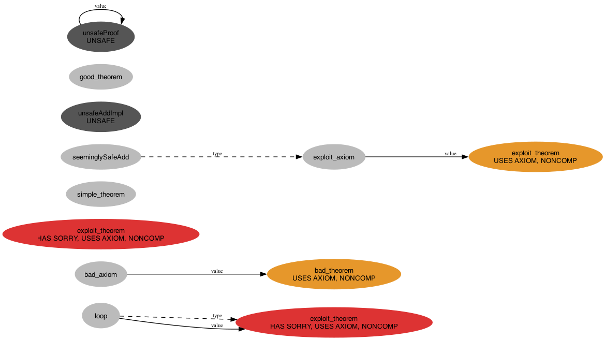

# LeanDepViz

A dependency visualization and **multi-checker verification tool** for Lean 4 projects. LeanDepViz extracts declaration dependencies and provides a unified framework for running multiple independent verification tools, giving you defense-in-depth assurance for your Lean code.

## Features

- **Multi-Checker Verification** (v0.3.0): Run multiple independent verifiers (LeanParanoia, lean4checker, SafeVerify) with unified reporting
- **Defense in Depth**: Different checkers catch different issues - policy violations, kernel corruption, statement changes
- **Interactive Viewer**: Sortable table with per-tool columns, embedded dependency graph, failures sorted to top
- **Smart Filtering**: By default, keeps only declarations from your project's root modules, producing manageable graph sizes
- **Multiple Output Formats**: Generate DOT files, JSON for verification, or render directly to SVG/PNG via Graphviz
- **Unified Report Format**: Easy to integrate new verification tools with consistent JSON schema

## 🎯 Live Examples

**Try the interactive viewer with real data:**

- **[Verification Demo](https://cameronfreer.github.io/LeanDepViz/verification-demo.html)** ⭐ **Recommended**
  - 12 declarations verified by 3 independent tools
  - Shows defense-in-depth: LeanParanoia, lean4checker, SafeVerify
  - Sortable columns, embedded graph, multi-tool results

- **[Exchangeability Project](https://cameronfreer.github.io/LeanDepViz/example-exchangeability.html)**
  - Real-world example: ~800 declarations from probability theory formalization
  - Interactive dependency graph exploration

- **[StrongPNT Project](https://cameronfreer.github.io/LeanDepViz/strongpnt-example.html)**
  - Strong Prime Number Theorem formalization
  - 1129 declarations, complex analysis and number theory
  - Demonstrates large-scale project visualization

- **[Basic Demo](https://cameronfreer.github.io/LeanDepViz/leanparanoia-test-demo.html)**
  - Simple 3-declaration example
  - Good starting point to understand the viewer

**All examples** available at: https://cameronfreer.github.io/LeanDepViz/

### Example: Multi-Tool Verification

The verification demo uses test files from [LeanParanoia](https://github.com/oOo0oOo/LeanParanoia) demonstrating various verification scenarios:

**Interactive Table View:**

*17 declarations verified by LeanParanoia, lean4checker, and SafeVerify. Red ✗ = failed, Green ✓ = passed, — = not checked.*

**Dependency Graph:**

*Dependency relationships between test declarations from LeanParanoia's test suite.*

Examples include:
- ✅ `good_theorem`, `simple_theorem` - Pass all checks
- ❌ `bad_axiom` - Custom axiom (caught by all 3 tools)
- ❌ `exploit_theorem` - Uses unsafe code (caught by all 3 tools)
- ❌ Various sorry, unsafe, and partial function violations

**Credit**: Example declarations from [LeanParanoia test suite](https://github.com/oOo0oOo/LeanParanoia/tree/main/tests/lean_exploit_files)

## Installation

### As a Lake Dependency (Recommended)

Add to your project's `lakefile.lean`:

```lean
require LeanDepViz from git
  "https://github.com/cameronfreer/LeanDepViz.git" @ "main"
```

Then:

```bash
lake update LeanDepViz
lake build depviz
```

### Manual Installation

Clone this repository and build:

```bash
git clone https://github.com/cameronfreer/LeanDepViz.git
cd LeanDepViz
lake build
```

## Quick Start

### 1. Generate Dependency Graph

From your project directory:

```bash
lake exe depviz --roots MyProject --json-out depgraph.json --dot-out depgraph.dot
```

This creates:
- `depgraph.json` - Machine-readable format for verification (for Table View)
- `depgraph.dot` - GraphViz format for visualization (for Graph View)

### 2. (Optional) Run Policy-Based Verification

If you want to verify code quality with LeanParanoia:

```bash
# Install Python dependencies
pip install pyyaml

# Copy example policy
cp .lake/packages/LeanDepViz/examples/policy.yaml ./my-policy.yaml
# Edit my-policy.yaml to match your project structure

# Run checks
python .lake/packages/LeanDepViz/scripts/paranoia_runner.py \
  --depgraph depgraph.json \
  --policy my-policy.yaml \
  --out paranoia_report.json \
  --jobs 8
```

### 3. View Results

Open the interactive viewer:

```bash
# Copy viewer to your project (one-time)
cp .lake/packages/LeanDepViz/viewer/paranoia-viewer.html ./

# Open in browser
open paranoia-viewer.html

# Then load your files:
# - In Table View: Load depgraph.json and (optionally) paranoia_report.json
# - In Graph View: Load depgraph.dot for visual graph
```

## Example Outputs

Want to see what LeanDepViz produces? Check out the examples:

> **Note**: To view examples locally, use a local web server instead of opening files directly:
> ```bash
> python serve.py
> # Then open http://localhost:8000/docs/
> ```
> This is required for the Graph View to work correctly (browser security restrictions).

### Real-World Project Output
`examples/output/` - Complete output from the [Exchangeability project](https://github.com/cameronfreer/exchangeability) (probability theory formalization with ~800 declarations):

- **Interactive viewer**: [Live Demo](https://cameronfreer.github.io/LeanDepViz/example-exchangeability.html)
- **All formats**: JSON, DOT, SVG, PNG, and embedded HTML
- See `examples/output/README.md` for details about each format and file sizes

### Multi-Checker Verification Demo
`examples/leanparanoia-tests/` - Comprehensive demo with multiple verification tools:

**🎯 [Verification Demo](https://cameronfreer.github.io/LeanDepViz/verification-demo.html)** (Recommended) - **12 declarations verified by 3 tools**

Shows defense-in-depth verification with:
- **LeanParanoia**: Policy enforcement
- **lean4checker**: Kernel replay
- **SafeVerify**: Reference vs implementation

Results: ✅ 2 Pass (all tools) | ❌ 10 Fail (various exploits caught by multiple checkers)

**Example Categories**:
- 🔴 Custom Axioms | 🟡 Sorry Usage | 🟠 Unsafe Code | 🟣 Partial Functions | 🟢 Valid Code

**Legacy Demos** (single-tool):
- **📊 [Basic Demo](https://cameronfreer.github.io/LeanDepViz/leanparanoia-test-demo.html)** - 3 declarations (LeanParanoia only)
- **📈 [All Examples](https://cameronfreer.github.io/LeanDepViz/leanparanoia-examples-all.html)** - 12 declarations (LeanParanoia only)

See `examples/leanparanoia-tests/README.md` for details

## Usage

### Basic Commands

Generate a filtered dependency graph:

```bash
lake exe depviz --roots MyProject --dot-out depgraph.dot
```

Include additional module prefixes:

```bash
lake exe depviz --roots MyProject --include-prefix Std,Init --dot-out depgraph.dot
```

Generate both DOT and JSON:

```bash
lake exe depviz --roots MyProject --dot-out depgraph.dot --json-out depgraph.json
```

Render directly to SVG/PNG (requires Graphviz):

```bash
lake exe depviz --roots MyProject --svg-out depgraph.svg --png-out depgraph.png
```

### CLI Options

- `--roots <name>`: Project root name(s) for filtering (required)
- `--dot-out <file>`: Output DOT file path
- `--json-out <file>`: Output JSON file path (for LeanParanoia integration)
- `--svg-out <file>`: Output SVG file path (requires Graphviz)
- `--png-out <file>`: Output PNG file path (requires Graphviz)
- `--include-prefix <prefixes>`: Comma-separated list of additional module prefixes to include
- `--keep-all`: Disable filtering entirely (include all declarations)

### Multi-Checker Workflow (v0.3.0)

For defense-in-depth verification, run multiple checkers and merge their results:

```bash
# 1. Extract dependency graph
lake exe depviz --roots MyProject --json-out depgraph.json --dot-out depgraph.dot

# 2. Run individual checkers
python scripts/paranoia_runner.py --depgraph depgraph.json --policy policy.yaml --out paranoia.json
python scripts/lean4checker_adapter.py --depgraph depgraph.json --out kernel.json
python scripts/safeverify_adapter.py --depgraph depgraph.json --target-dir /path/to/baseline --submit-dir .lake/build --out safeverify.json

# 3. Merge results
python scripts/merge_reports.py --reports paranoia.json kernel.json safeverify.json --out unified.json

# 4. View in interactive viewer
python scripts/embed_data.py --viewer viewer/paranoia-viewer.html --depgraph depgraph.json --dot depgraph.dot --report unified.json --output review.html
open review.html
```

See [MULTI_CHECKER.md](MULTI_CHECKER.md) for complete documentation.

## Verification Tools

### LeanParanoia - Policy Enforcement

[LeanParanoia](https://github.com/oOo0oOo/LeanParanoia) enforces source-level policies: no `sorry`, approved axioms only, no unsafe/extern/partial functions.

**Note**: Currently has version compatibility constraints with Mathlib that are being addressed. Works well for standalone projects. See `examples/leanparanoia-tests/` for examples.

**What it checks**:
- Sorry usage
- Custom axioms (only standard axioms allowed)
- Unsafe declarations
- Partial/non-terminating functions
- Extern implementations

### lean4checker - Kernel Replay

[lean4checker](https://github.com/leanprover/lean4checker) independently replays your proof environment in the Lean kernel to verify correctness.

**What it checks**:
- Environment integrity
- Kernel-level correctness
- Declaration validity

**Usage**:
```bash
python scripts/lean4checker_adapter.py --depgraph depgraph.json --out kernel.json
```

Use `--fresh` flag for thorough checking including imports (slower but more comprehensive).

### SafeVerify - Reference vs Implementation

[SafeVerify](https://github.com/GasStationManager/SafeVerify) compares a reference/specification version against an implementation to ensure they match.

**What it checks**:
- Statement equality (theorems haven't changed)
- No extra axioms in implementation
- No unsafe/partial in implementation vs reference

**Usage**:
```bash
# Build baseline reference
git checkout main && lake build
mv .lake/build /tmp/target_build

# Build implementation
git checkout feature-branch && lake build

# Compare
python scripts/safeverify_adapter.py \
  --depgraph depgraph.json \
  --target-dir /tmp/target_build \
  --submit-dir .lake/build \
  --out safeverify.json
```

Perfect for PR reviews and verifying AI-generated code.

## LeanParanoia Integration

LeanDepViz provides a Python wrapper for running LeanParanoia checks.

### Setup

1. **Add LeanParanoia to your project** (in `lakefile.lean`):
   ```lean
   require paranoia from git
     "https://github.com/oOo0oOo/LeanParanoia.git" @ "main"
   ```

2. **Update and build dependencies**:
   ```bash
   lake update paranoia
   lake build paranoia
   ```
   
   Note: If you get toolchain mismatches, sync your `lean-toolchain` with Mathlib:
   ```bash
   cp .lake/packages/mathlib/lean-toolchain ./lean-toolchain
   lake clean
   lake build
   ```

3. **Install Python dependencies**:
   ```bash
   pip install pyyaml
   ```

### Workflow

1. **Generate dependency graph**:
   ```bash
   lake exe depviz --roots MyProject --json-out depgraph.json
   ```

2. **Create a policy file** (copy and customize an example):
   ```bash
   cp .lake/packages/LeanDepViz/examples/policy.yaml ./my-policy.yaml
   ```
   
   Edit `my-policy.yaml` to define zones matching your project structure.

3. **Run policy checks**:
   ```bash
   # Recommended: Use --summary-only for large projects (smaller output)
   python .lake/packages/LeanDepViz/scripts/paranoia_runner.py \
     --depgraph depgraph.json \
     --policy my-policy.yaml \
     --out paranoia_report.json \
     --summary-only \
     --jobs 8
   
   # Or without --summary-only for detailed output (larger files)
   ```
   
   **Performance tip**: The `--summary-only` flag captures only error summaries instead of full output, reducing report size from gigabytes to megabytes for large projects.

4. **View results** in the interactive viewer:
   ```bash
   open paranoia-viewer.html
   # Load depgraph.json and paranoia_report.json in the browser
   ```

### Policy Files

The repository includes three example policy configurations in the `examples/` directory:

- **`policy.yaml`**: Balanced policy for production code with multiple zones
- **`policy-strict.yaml`**: Ultra-strict (constructive-only, no Classical.choice)
- **`policy-dev.yaml`**: Lenient policy for development (only tracks `sorry`)

Edit these files to define zones with different verification requirements for your project.

### Policy File Structure

```yaml
zones:
  - name: "Zone Name"
    include: ["MyProject.Module.**"]     # Which modules to check
    exclude: ["MyProject.Module.Skip"]   # Exceptions
    allowed_axioms:                      # Whitelist of axioms
      - "propext"
      - "Classical.choice"
      - "Quot.sound"
    forbid:                              # What to forbid
      - "sorry"
      - "metavariables"
      - "unsafe"
    trust_modules:                       # Don't re-verify these
      - "Std"
      - "Mathlib"
```

### What Gets Verified

For each declaration, LeanParanoia can check:

- **Sorry/Admit**: Incomplete proofs
- **Axioms**: Use of axioms beyond your whitelist
- **Metavariables**: Partially elaborated terms
- **Unsafe**: Unsafe constructs
- **Extern**: External (FFI) declarations

Each zone in your policy can have different rules.

## Interactive Viewer

The `viewer/paranoia-viewer.html` file provides a web-based interface with **two viewing modes**:

### 📊 Table View
- Browse all declarations with verification status
- Filter by pass/fail, zone, or search text
- See detailed error messages for failing checks
- Identify which axioms are used by each declaration
- Click any row for detailed information

### 🕸️ Graph View
- **Visual dependency graph** rendered from DOT files
- Interactive zoom and pan
- See the full structure of your project
- Load with: `lake exe depviz --roots YourProject --dot-out graph.dot`

No server required - pure client-side JavaScript that works offline.

### Hosted Viewer

**Try it live**: [https://cameronfreer.github.io/LeanDepViz/](https://cameronfreer.github.io/LeanDepViz/)

Visit the URL, load your JSON files, and explore your project's dependencies. All processing happens in your browser - no data is sent to any server.

### Sharing Your Results

#### Option 1: Share JSON Files

Share your `depgraph.json` and `paranoia_report.json` files via GitHub Gist or email. Recipients can load them into the hosted viewer.

#### Option 2: Standalone HTML with Embedded Data

Create a self-contained HTML file with your data embedded:

```bash
python .lake/packages/LeanDepViz/scripts/embed_data.py \
  --depgraph depgraph.json \
  --dot depgraph.dot \
  --report paranoia_report.json \
  --output my-project-report.html
```

This creates a single HTML file that:
- Contains all your data embedded (JSON graph + DOT graph + verification report)
- **Both Table View and Graph View work** without file uploads
- Can be opened directly in any browser
- Can be hosted on GitHub Pages, Vercel, Netlify, or any static hosting
- Requires no server - works completely offline

Share the HTML file or host it anywhere!

## Installing Graphviz

Graphviz is required for SVG/PNG output formats.

### macOS (Homebrew)
```bash
brew install graphviz
```

### Ubuntu/Debian
```bash
sudo apt-get install graphviz
```

### Fedora
```bash
sudo dnf install graphviz
```

### Arch Linux
```bash
sudo pacman -S graphviz
```

### Windows
```bash
choco install graphviz
```

Or download the MSI installer from [graphviz.org](https://graphviz.org/download/)

## Viewing DOT Files

If you generate a `.dot` file, you can render it manually with Graphviz:

```bash
dot -Tsvg depgraph.dot -o depgraph.svg
dot -Tpng depgraph.dot -o depgraph.png
```

Or open it with visualization tools like:
- [Graphviz Online](https://dreampuf.github.io/GraphvizOnline/)
- VS Code extensions (e.g., Graphviz Preview)
- Desktop viewers (e.g., xdot, gvedit)

## Example: Complete Workflow

```bash
# 1. Add LeanDepViz to your project's lakefile.lean
# 2. Update dependencies
lake update LeanDepViz
lake build depviz

# 3. Generate graph
lake exe depviz --roots MyProject --json-out depgraph.json

# 4. (Optional) Set up verification
lake update paranoia
lake build paranoia
pip install pyyaml

# 5. Create and customize policy
cp .lake/packages/LeanDepViz/examples/policy.yaml ./my-policy.yaml
# Edit my-policy.yaml with your project's module structure

# 6. Run verification
python .lake/packages/LeanDepViz/scripts/paranoia_runner.py \
  --depgraph depgraph.json \
  --policy my-policy.yaml \
  --out report.json \
  --jobs 8

# 7. View results
cp .lake/packages/LeanDepViz/viewer/paranoia-viewer.html ./
open paranoia-viewer.html
```

## Use Cases

### Find All Sorries Before PR

```bash
python scripts/paranoia_runner.py \
  --policy examples/policy-dev.yaml \
  --depgraph depgraph.json \
  --out report.json
```

Exit code will be 1 if any sorries are found - perfect for CI.

### Identify Classical Logic Dependencies

```bash
python scripts/paranoia_runner.py \
  --policy examples/policy-strict.yaml \
  --depgraph depgraph.json \
  --out strict-report.json
```

See which theorems require Classical.choice.

### Enforce Different Standards per Module

Edit `policy.yaml` to define zones with different rules for core vs. experimental code.

## Performance Tips

1. **Parallel execution**: Use `--jobs` equal to your CPU count
2. **Trust Mathlib/Std**: Always include in `trust_modules`
3. **Filter the graph**: Only check relevant modules
4. **Use dev policy first**: Quick sorry check before full verification

## Troubleshooting

### "lake exe depviz: command not found"

Build the executable:
```bash
lake build depviz
```

### "failed to read file ... incompatible header"

Toolchain mismatch. Sync with Mathlib:
```bash
cp .lake/packages/mathlib/lean-toolchain ./lean-toolchain
lake clean
lake build
```

### "No module named 'yaml'"

Install PyYAML:
```bash
pip install pyyaml
```

### Script runs very slowly

1. Use more parallel jobs: `--jobs 16`
2. Ensure `trust_modules` includes Std and Mathlib
3. Consider filtering to specific modules

## Implementation Details

The filtering logic:

1. **Node Filtering**: Keeps only declarations from modules matching your specified root prefix(es)
2. **Edge Filtering**: Removes edges where either endpoint was filtered out
3. **Consistent Output**: Ensures the resulting DOT/JSON references only existing nodes

Default behavior produces graphs with hundreds to thousands of nodes instead of millions, making them practical to visualize with standard tools.

The JSON output includes full declaration names, module paths, kinds (theorem/def), and metadata about `sorry`, axioms, and unsafe constructs - everything needed for policy-based verification.

## Contributing

Contributions are welcome! Please:
- Open an issue for bugs or feature requests
- Submit pull requests with clear descriptions
- Follow the existing code style
- Add tests for new features

## License

[MIT License](LICENSE)

## Links

- [LeanParanoia](https://github.com/oOo0oOo/LeanParanoia) - Policy-driven verifier
- [lean4checker](https://github.com/leanprover/lean4checker) - Environment replay tool
- [SafeVerify](https://github.com/GasStationManager/SafeVerify) - Reference vs implementation comparison
- [Graphviz](https://graphviz.org/) - Graph visualization software
